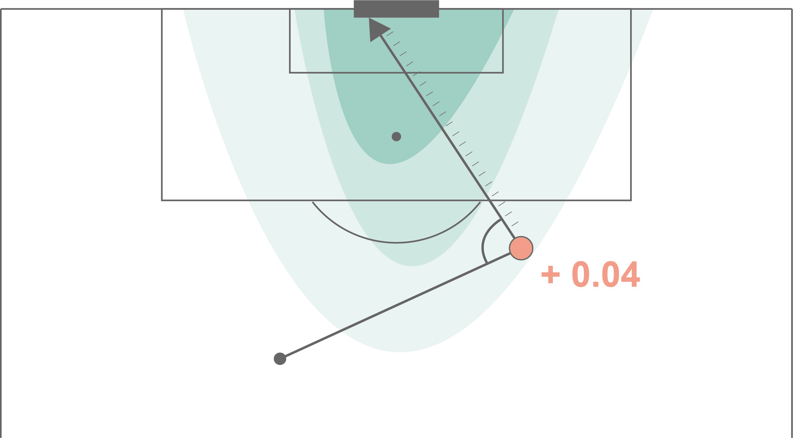

<div align="center">
	<h1>Soccer xG</h1>
  <p><b>A Python package for training and analyzing expected goals (xG) models in soccer.</b></p>
	
	<br>
	<br>
	<br>
</div>

## About

This repository contains the code and models for our series on the analysis of xG models:

- [How data availability affects the ability to learn good xG models](https://dtai.cs.kuleuven.be/sports/blog/how-data-availability-affects-the-ability-to-learn-good-xg-models)
- [Illustrating the interplay between features and models in xG](https://dtai.cs.kuleuven.be/sports/blog/illustrating-the-interplay-between-features-and-models-in-xg)
- [How data quality affects xG](https://dtai.cs.kuleuven.be/sports/blog/how-data-quality-affects-xg)

In particular, it contains code for experimenting with an exhaustive set of features and machine learning pipelines for predicting xG values from soccer event stream data. Since we rely on the [SPADL](https://github.com/ML-KULeuven/socceraction) language as input format, `soccer_xg` currently supports event streams provided by Opta, Wyscout, and StatsBomb. 

## Getting started

The recommended way to install `soccer_xg` is to simply use pip:

```sh
$ pip install soccer_xg
```

Subsequently, a basic xG model can be trained and applied with the code below:

```python
from itertools import product
from soccer_xg import XGModel, DataApi

# load the data
provider = 'wyscout_opensource'
leagues = ['ENG', 'ESP', 'ITA', 'GER', 'FRA']
seasons = ['1718']
api = DataApi([f"data/{provider}/spadl-{provider}-{l}-{s}.h5" 
        for (l,s) in product(leagues, seasons)])
# load the default pipeline
model = XGModel()
# train the model
model.train(api, training_seasons=[('ESP', '1718'), ('ITA', '1718'), ('GER', '1718')])
# validate the model
model.validate(api, validation_seasons=[('ENG', '1718')])
# predict xG values
model.estimate(api, game_ids=[2500098])
```

Although this default pipeline is suitable for computing xG, it is by no means the best possible model. 
The notebook [`4-creating-custom-xg-pipelines`](./notebooks/4-creating-custom-xg-pipelines.ipynb) illustrates how you can train your own xG models or you can use one of the four pipelines used in our blogpost series. These can be loaded with:

```python
XGModel.load_model('openplay_logreg_basic')
XGModel.load_model('openplay_xgboost_basic')
XGModel.load_model('openplay_logreg_advanced')
XGModel.load_model('openplay_xgboost_advanced')
```

Note that these models are meant to predict shots from open play. To be able to compute xG values from all shot types, you will have to combine them with a pipeline for penalties and free kicks. 

```python
from soccer_xg import xg

openplay_model = xg.XGModel.load_model(f'openplay_xgboost_advanced') # custom pipeline for open play shots
openplay_model = xg.PenaltyXGModel() # default pipeline for penalties
freekick_model = xg.FreekickXGModel() # default pipeline for free kicks

model = xg.XGModel()
model.model = [openplay_model, openplay_model, freekick_model]
model.train(api, training_seasons=...)
```

## For developers

**Create venv and install deps**

    make init

**Install git precommit hook**

    make precommit_install

**Run linters, autoformat, tests etc.**

    make pretty lint test

**Bump new version**

    make bump_major
    make bump_minor
    make bump_patch

## License

Copyright (c) DTAI - KU Leuven – All rights reserved.  
Licensed under the Apache License, Version 2.0  
Written by [Pieter Robberechts](https://people.cs.kuleuven.be/~pieter.robberechts/), 2020
